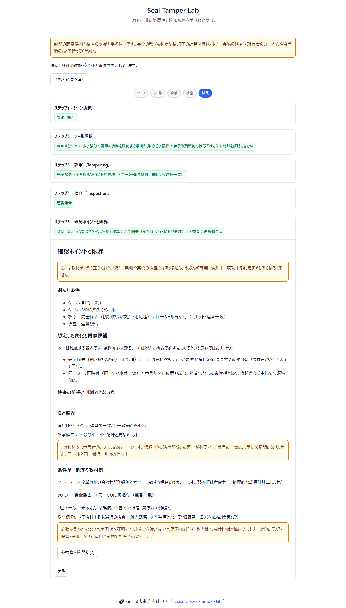

English · [日本語](README.md)

# Seal Tamper Lab - Educational Tool for Tamper-Evident Seal Security


[](https://ipusiron.github.io/seal-tamper-lab/)

**Day061 - 100 Security Tools Built with Generative AI**

Seal Tamper Lab is an educational tool about tamper-evident seals used in logistics and information protection.
Choose a setting, seal, hypothetical modification, and inspection methods to learn what traces to look for and what cannot be concluded. The tool does not inspect real objects or simulate physical processes, and it does not determine whether tampering occurred or calculate detection or success rates.

Physical security is as important as cybersecurity, but is often overlooked. Physical intrusion and tampering by industrial spies, foreign intelligence services, or insiders can cause serious harm when combined with digital attacks. This tool also aims to raise awareness of defenses against such physical threats.

The interface and screenshots are currently in Japanese. This README provides the English documentation.

---

## 🌐 Live demo

👉 [https://ipusiron.github.io/seal-tamper-lab/](https://ipusiron.github.io/seal-tamper-lab/)

Try it directly in your browser.

---

## 📸 Screenshot

> 
>
> *Inspection points and limitations for the selected conditions (Japanese interface)*

---

## ⚙️ Features

- Cards for 3 settings, 5 seal types, 6 hypothetical modifications, and 6 inspection methods
- Single selection for the setting and seal; multiple selection for modifications and inspections
- Synchronized selected cards, summaries, and removable selection pills; results invalidated when conditions change
- Later steps disabled until the required earlier selections are complete
- Possible observations, inspection prerequisites, limitations, and educational examples matching the selected conditions
- Verified references expanded below the results (external links open in a new tab)
- Loading-error guidance and retry; reset of selections and results
- Keyboard operation, narrow-screen layouts, and support for the operating system's reduced-motion setting

The image section appears only when an existing local image is registered. The distributed data has no observation images, so the results do not show image buttons. Card illustrations are explanatory schematics.

### How to use

1. Select a setting, then a seal.
2. Select at least one hypothetical modification and at least one inspection method.
3. Open “確認ポイントと限界” (Inspection points and limitations) and read each inspection's prerequisites.
4. After changing conditions, reopen the results. Use “選択と結果を消す” (Clear selections and results) to start over.

Use Tab to move between controls. Use the arrow keys and Home/End to select a setting or seal, and Space/Enter to toggle modifications and inspections. Removing a selection pill also deselects its card.

### Reading the results

The 4 existing examples appear only when the setting, seal, and set of modifications match exactly. Selection order does not matter. The inspection selection is used to identify inspections listed in the example that have not been selected. Even without a matching example, the possible observations and limitations of the selected inspections are displayed.

Limitations are shown for serial-number checks on unnumbered seals and transmitted-light inspection of objects that do not transmit light. Attributes such as numbering and materials are assumptions for this teaching material, not specifications shared by every product of the same type.

---

## 💡 Use cases

Ways of using this tool in particular

- Confirming that you cannot move on without finishing the previous step (procedure and prerequisite classes): asking for a guide with nothing selected lists four missing things in order, the scene, the seal, the attacks and the inspections. Until an attack is selected you cannot reach the inspection step (the 4th). You can confirm, from the locked steps, that inspection has an order and prerequisites and you cannot skip ahead
- Confirming that an inspection has a precondition for its target, and shows "cannot be applied" when it does not fit (inspection-planning classes): selecting a serial-number check for unnumbered clear tape shows the reason it cannot apply (noSerial). Selecting transmitted-light observation for a cardboard box gives the reason the light does not pass through (opaqueSurface). You can confirm, by combination, that no inspection is universal and that a mismatch with the target gives "not applicable" rather than a result
- Confirming that one inspection looks for several signs (detection-design classes): the serial-number check looks for two signs, a serial mismatch (serial_mismatch) and an unexpected batch (unexpected_batch). You can confirm, from the inspection-to-sign mapping, that one inspection picks up several traces of tampering while one trace is corroborated by several inspections

In training or classes, use the tool to discuss how the same observation can have multiple causes and how inspections depend on records and equipment. For example, selecting unnumbered clear tape and a serial-number check displays why that inspection cannot be applied.

In workshops, participants can explain what they would check under the selected conditions and what they could not conclude. The tool does not support tampering competitions or detection-rate scoring. It is not a replacement for inspecting real objects, organizational inspection procedures, or expert examination.

---

## 🏷️ Characteristics of the seal types

### 1. VOID-pattern seals

These labels change their displayed text or pattern when peeled. Some leave a mark on the object; non-transfer types display text on the label itself. [LINTEC's product description](https://www.lintec.co.jp/topics/newsrelease/171017_a.html) gives an example of a non-transfer type.

A change in the display can be a clue to peeling, but the absence of a mark or residue does not establish that an item is unopened. Temperature, the application surface, and adhesive specifications must be considered.

### 2. Hologram seals

Their patterns change with the viewing angle and can be compared with an authentic reference sample. However, a glossy appearance alone does not confirm authenticity or an unopened state. Resistance depends on the product's construction and application conditions.

### 3. Paper seals

Peeling may tear the paper or disturb its fibers. Behavior varies with the paper and adhesive specifications; an absence of visible damage does not establish the seal's application history.

### 4. Clear tape (unnumbered)

This teaching example represents simple sealing or temporary fastening. Serial-number checks cannot be applied because there is no number. Bubbles and distortion are possible observations, but they can also arise during application and do not, by themselves, establish that tape was reapplied.

### 5. Serial-numbered security tape

The number can be compared with a record made at application. A matching number, however, does not prove that an item is unopened. Being from the same batch and having the same number are also different conditions. Other appearance details, inventory, and storage and handover records should also be checked.

---

## ⚔️ Modification categories and comparison

The values from 1 to 5 below are hypothetical assumptions for discussing comparisons. They are not measurements, product ratings, or probabilities of discovery. Selecting a modification does not perform actual tampering, and the values are not used to score results.

| Hypothetical modification | Cost | Time | Skill | Trace visibility | Possible observations |
|---|---:|---:|---:|---:|---|
| Complete removal | 3 | 4 | 3 | 4 | Roughened underlying surface, uneven density |
| Reapplying the same seal | 4 | 2 | 4 | 2 | Raised edges, uneven adhesion |
| Peeling with warm air and reattaching | 1 | 2 | 1 | 2 | Bubbles, distortion |
| Partial cutting | 1 | 3 | 3 | 3 | Steps, gloss differences, misalignment |
| Loosening adhesive with a solvent | 2 | 2 | 2 | 3 | Changes in surface gloss or texture |
| Disguising the underlying surface | 3 | 4 | 3 | 3 | Differences from a baseline photograph, surface changes |

There is no guarantee that traces will remain or that an inspection will find them. Scratches and bubbles can also arise during application, transport, or aging. Actual modification procedures, tool-use instructions, and conditions for success on specific targets are outside the scope of this tool.

---

## 🔍 Inspection methods and their characteristics

The possible observations shown on screen are not findings detected from a real object. Each method has the following prerequisites and limitations.

| Inspection | Possible observations | Prerequisites and limitations |
|---|---|---|
| Oblique lighting | Steps, bubbles, distortion | Appearance depends on material and lighting; the cause cannot be identified |
| Baseline photograph comparison | Differences in position, angle, or texture | Requires a trustworthy photograph taken immediately after application; photographic conditions can also cause differences |
| Serial-number comparison | Mismatched numbers or batches | Requires a number and trustworthy records; a match does not prove that the item is unopened |
| Macro inspection | Edges, uneven adhesion, paper fibers | Depends on magnification and lighting; small scratches alone do not establish tampering |
| Transmitted-light inspection | Uneven density, possible peeling marks | Requires light transmission; may not apply to cardboard, overlapping layers, metal, or similar objects |
| UV/IR inspection | Material fluorescence or reflectance differences | Requires suitable materials, light sources, and imaging equipment; does not identify the cause or establish past heating |

UV-induced fluorescence, reflectance differences under near-infrared illumination, and thermal imaging are distinct. Near-infrared illumination cannot measure temperature distribution. [FLIR's explanation](https://oem.flir.com/en-150/support/support-center/knowledge-base/what-is-the-difference-between-active-ir-and-thermal-imaging/) distinguishes active IR using reflected light from thermal imaging. Checking microprinting also requires methods such as magnified observation.

A photograph taken on receipt can provide a basis for later comparison, but does not prove that no tampering occurred before receipt. If something looks suspicious, document the condition according to your organization's procedures and consult the responsible person.

---

## ⚠️ Precautions and limits on conclusions

The presence of a seal, a matching number, and an absence of detected traces do not prove that an item is unopened. Even when traces are present, this teaching material cannot determine their cause, timing, or the person responsible.

Do not assess a seal in isolation. Consider product specifications, application records, inventory management, storage conditions, handover history, and procedures for handling anomalies. [The bibliographic record and abstract of Johnston's paper](https://digital.library.unt.edu/ark:/67531/metadc933842/) also discuss seals and operational limitations. That reference does not substantiate this tool's numerical assumptions or every combination of conditions.

This tool is for education, not a manual for carrying out intrusion or tampering. When examining real objects, obtain the owner's permission and follow safe procedures.

### Processing in the browser

The teaching data loaded during use is JSON from the same origin. Selections are held only in memory and disappear on reload. No analytics services or external images are used. Opening a reference link connects to the external website.

Data strings are displayed without interpreting them as HTML. References are restricted to HTTPS URLs without credentials, and images to limited formats under the local assets directory. The CSP does not allow external or inline scripts. However, this does not claim that a meta setting on GitHub Pages alone can prevent other sites from embedding the page.

---

## 📊 Data structure

The authoritative teaching data is [data/db.json](data/db.json).

- `scenes`: objects and surface descriptions
- `seals`: types, characteristics, limitations, and whether the teaching example has a number
- `attacks`: hypothetical modifications, possible observations, and assumed values from 1 to 5
- `inspections`: observation methods and target classifications
- `scenarios`: 4 existing examples corresponding to a setting, seal, and set of modifications
- `refs` / `images`: optional references and images; buttons are hidden when empty

`seal-core.js` checks duplicate IDs, field types, rating ranges, and references within scenarios. Invalid data prevents interaction from starting and prompts the user to retry. Reference URLs are validated; references included in the selected conditions are deduplicated by URL and displayed below the results.

---

## 🚀 Improvement ideas and TODO

- Japanese and English interfaces (the interface is currently Japanese; the README is available in both languages)
- Photographic observation materials with verified rights and shooting conditions
- Quizzes about prerequisites and comparisons between conditions

These are unimplemented candidates. There are no plans to turn the current explanations into detection-rate scores.

---

## 📁 Directory structure

```text
seal-tamper-lab/
├── .github/
│   └── workflows/
│       └── test.yml       # Node.js 22 push/PR tests
├── assets/
│   └── screenshot.png     # Results-screen screenshot
├── data/
│   └── db.json            # Teaching data
├── test/
│   ├── core.test.js       # Prerequisites, existing examples, and URLs
│   ├── content.test.js    # Wording, references, and safe rendering
│   └── readme-en.test.js  # Japanese/English README consistency
├── .nojekyll              # Disable Jekyll processing on GitHub Pages
├── index.html             # Interface and CSP
├── script.js              # Selection state, step navigation, and DOM rendering
├── seal-core.js           # Data validation and explanatory data
├── seal-messages.js       # Dynamic Japanese messages
├── style.css              # Layout and schematic illustrations
├── package.json           # Dependency-free test configuration
├── CLAUDE.md              # Development guidelines
├── README.md              # Japanese documentation
├── README.en.md           # English documentation
└── LICENSE                # MIT license
```

## 💻 Requirements and verification

Open the tool over HTTP/HTTPS in a browser supporting JavaScript and the Fetch API. Opening files directly with `file://` is not supported. For local use, run the following in this directory:

```sh
python -m http.server 8000
```

Open [http://localhost:8000/](http://localhost:8000/). No build or dependency installation is required. Run tests with Node.js 22 or later:

```sh
npm test
```

Automated tests cover the 4 existing examples, prerequisites, invalid data, safe URLs and DOM handling, and limitations stated in the explanations. Selection, keyboard operation, reset, and retry after loading failure have been checked in Chromium, Edge, and Firefox, with widths of 320, 390, 768, and 1280px. Safari, physical smartphones, and screen readers have not been tested on actual devices.

---

## 📄 License

MIT License — see [LICENSE](LICENSE) for details.

---

## 🛠 About this tool

This tool was developed as part of the “100 Security Tools Built with Generative AI” project.
The project uses AI assistance to create and publish security-related tools over 100 days.

For project details and other tools, visit:

🔗 [https://akademeia.info/?page_id=42163](https://akademeia.info/?page_id=42163)
