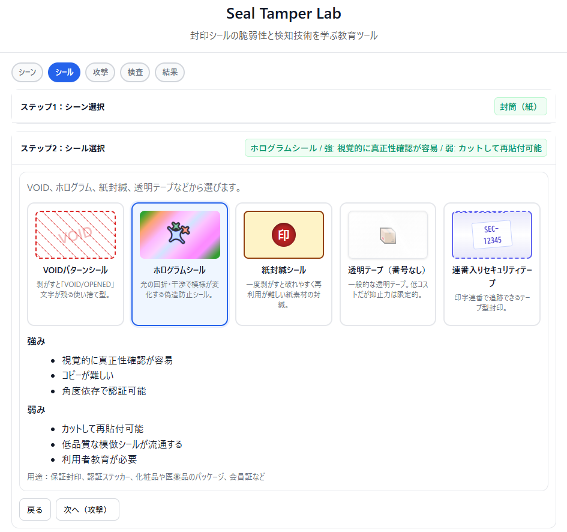

<!--
---
title: Seal Tamper Lab
category: physical-security
difficulty: 1
description: Educational tool to learn the vulnerabilities and detection techniques of tamper-evident seals
tags: [seal, tamper, security, education, physical security]
demo: https://ipusiron.github.io/seal-tamper-lab/
---
-->


[](https://ipusiron.github.io/seal-tamper-lab/)

**Day061 - 生成AIで作るセキュリティツール100**


# Seal Tamper Lab - 封印シールのセキュリティ教育ツール

**Seal Tamper Lab** は、物流や情報保護で利用される **封印シール** を題材にした教育ツールです。
改ざん手法と検査方法をシミュレーション的に学び、**「セキュリティシールを過信しない」** というリテラシーを養うことを目的としています。

**物理セキュリティ** は、サイバーセキュリティと同様に重要な領域でありながら、しばしば軽視されがちです。産業スパイ、外国情報機関、内部脅威による **物理的な侵入・改竄** は、デジタル攻撃と組み合わせることで深刻な被害をもたらす可能性があります。本ツールは、そうした **物理的脅威に対する防御意識** を高めることにも寄与します。

---

## 🌐 デモページ

👉 **[https://ipusiron.github.io/seal-tamper-lab/](https://ipusiron.github.io/seal-tamper-lab/)**

ブラウザーで直接お試しいただけます。

---

## 📸 スクリーンショット

>   
> *ホログラムシールを選択*

---

## ⚙️ 機能仕様

### 基本機能
- **カード型UI**による直感的な選択インターフェイス
- **ステップ1：シーン選択**（封筒／段ボール箱／機器筐体の3種類）
- **ステップ2：シール選択**（VOID、ホログラム、紙封緘、透明テープ、連番入りセキュリティテープの5種類）
- **ステップ3：攻撃手法選択**（複数選択可、コスト・時間・技術・発覚リスクを5段階表示）
- **ステップ4：検査手法選択**（複数選択可、斜光観察・基準写真比較・連番照合・マクロ観察・透過光観察・UV/IR観察の6種類）
- **ステップ5：結果表示＋解説**
- 参考資料・画像がある場合のみ「資料を開く」「画像を見る」ボタンを表示
- **アコーディオン型**の段階的なワークフロー
- **必須項目の選択制御**（未選択時は次のステップに進めない仕組み）

### セキュリティ上の注意喚起
- どのシールにも脆弱性が存在する（完全除去、同一シール再貼付など）
- **シール単体では絶対防御はできない**  
- 運用で補う（多層防御：連番ログ、基準写真、二重封印、署名跨ぎなど）

---

## 💡 活用シナリオ

1. **セキュリティ研修や授業での教材**  
   - 改ざん手法を実際に体験的に学べるため、物流・情報保護の現場教育や大学の情報セキュリティ講義において、教材として活用できます。  
   - 「シール＝安全」ではなく「痕跡を残すだけ」という本質を理解させることが可能です。  

2. **ワークショップやCTFの演習課題**  
   - 参加者が攻撃者役と検査者役に分かれて、「改ざんを試す」「痕跡を見抜く」という対戦型学習に利用できます。  
   - 競技的にスコア化（検出率や改ざん成功率）することで、楽しくセキュリティリテラシーを向上できます。

3. **物理セキュリティ専門家の育成**  
   - **企業のセキュリティ部門**: 機密情報保護、産業スパイ対策の実務研修として活用  
   - **法執行機関**: 証拠保全における封印システムの脆弱性理解、科学捜査技術の向上  
   - **重要インフラ事業者**: 原子力、電力、通信などの重要施設における物理防護対策の教育

4. **インテリジェンス・カウンターインテリジェンス教育**  
   - **政府機関職員**: 外国情報機関による物理侵入手法の理解、機密管理の重要性認識  
   - **防衛関連企業**: 技術情報漏えい防止、サプライチェーン・セキュリティの実践教育  
   - **研究機関**: 先端技術研究における物理的情報保護手法の習得

---

## 🏷️ 各種シールの詳細特性

本ツールで扱う5種類のセキュリティシールの詳細な特性と用途について解説します。

### 1. VOIDパターンシール
- **仕組み**: 剥がすと「VOID」「OPENED」文字が残る使い捨て型
- **強み**: 
  - 再接着が極めて困難
  - 視認性の高い改ざん痕跡
- **弱み**: 
  - シールごと完全除去されると痕跡も消える
  - 温度条件で粘着挙動が変わる場合あり
- **主な用途**: 物流封印、機器の保守口封印、検査済み封印
- **対抗手法**: 完全除去、低温/高温による粘着力変化の利用

### 2. ホログラムシール
- **仕組み**: 光の回折・干渉で模様が変化する偽造防止シール
- **強み**: 
  - 視覚的に真正性確認が容易
  - コピーが困難
  - 角度依存で認証可能
- **弱み**: 
  - カットして再貼付可能
  - 低品質な模倣シールが流通する
  - 利用者教育が必要
- **主な用途**: 保証封印、認証ステッカー、化粧品や医薬品のパッケージ、会員証など
- **対抗手法**: 偽造ホログラムの大量製造、部分カット攻撃

### 3. 紙封緘シール
- **仕組み**: 一度剥がすと破れやすく再利用が難しい紙素材の封緘
- **強み**: 
  - 破断で改ざん痕が残る
  - 低コスト
- **弱み**: 
  - 水蒸気や溶剤で糊が緩む場合あり
  - 完全除去で「貼付の事実」が消える
- **主な用途**: 公文書封緘、郵送封印
- **対抗手法**: 水蒸気処理、溶剤による糊の軟化、完全除去

### 4. 透明テープ（番号なし）
- **仕組み**: 一般的な透明テープ、低コストだが抑止力は限定的
- **強み**: 
  - 入手容易
  - 視認性が高く貼りやすい
- **弱み**: 
  - 温風で剥がし再貼付が可能になりやすい
  - 連番なし＝追跡困難
- **主な用途**: 簡易封印、仮止め
- **対抗手法**: 温風処理、ドライヤーによる加熱除去（最も脆弱）

### 5. 連番入りセキュリティテープ
- **仕組み**: 印字連番で追跡できるテープ型封印
- **強み**: 
  - 連番照合で一致/不一致を判定
  - 運用ログと組み合わせやすい
- **弱み**: 
  - 連番を調達できる内部不正には弱い
  - 位置ズレや段差の検査が必須
- **主な用途**: 倉庫封印、輸送シール
- **対抗手法**: 内部犯行による正規シール流用、連番データベースへの不正アクセス

---

## ⚔️ 攻撃分類と比較

本ツールで扱う攻撃手法は以下のように分類され、それぞれ**コスト・時間・技術・発覚リスク**の観点で比較できます：

| 攻撃手法 | コスト | 時間 | 技術 | 発覚リスク | 特徴 |
|---------|-------|------|------|-----------|------|
| **完全除去（削ぎ取り/溶剤/下地処理）** | 3 | 4 | 3 | 4 | 下地の荒れや密度ムラが残りやすい |
| **同一シール再貼付（同ロット/連番一致）** | 4 | 2 | 4 | 2 | 正面は自然、斜光/マクロでエッジ段差が露見 |
| **温風で剥がし再接着** | 1 | 2 | 1 | 2 | 透明テープ等で微小気泡/歪みが出やすい |
| **部分カット（切り欠き→再配置）** | 1 | 3 | 3 | 3 | カットラインの段差や光沢差、位置ズレが検出ポイント |
| **溶剤で糊を緩める** | 2 | 2 | 2 | 3 | 溶剤痕や表面の艶変化が残る場合あり |
| **下地偽装（研磨/清掃→新規貼付）** | 3 | 4 | 3 | 3 | 基準写真比較や斜光で不整合が露見 |

*※数値は1（低）〜5（高）の5段階評価*

**攻撃者の視点**では「低コスト・短時間・低技術・低リスク」が理想的ですが、**防御者の視点**では適切な検査手法を組み合わせることで発覚リスクを高められます。

### 各攻撃手法の詳細解説

#### 1. 完全除去（削ぎ取り/溶剤/下地処理） [コスト:3, 時間:4, 技術:3, 発覚リスク:4]
- **手法**: シールと接着剤を含め、下地から痕跡ごと取り去る
- **予想効果**: 「最初から無かった」見た目に近づくが、下地の荒れや密度ムラが残りやすい
- **必要工具**: カッター、溶剤（IPA、アセトン等）、研磨材
- **検出方法**: 斜光観察による表面荒れ確認、基準写真との比較
- **対象シール**: 全シール（特に紙封緘、透明テープで有効）

#### 2. 同一シール再貼付（同ロット/連番一致） [コスト:4, 時間:2, 技術:4, 発覚リスク:2]
- **手法**: 同じロット・同一連番のシールを用意して貼り直す
- **予想効果**: 正面は自然でも、斜光/マクロでエッジ段差や接着ムラが露見
- **必要工具**: 正規シール、精密カッター、位置決め治具
- **検出方法**: エッジ段差の観察、基準写真比較、位置・角度の微細なズレ確認
- **対象シール**: VOID、ホログラム、連番テープ（内部犯行が前提）

#### 3. 温風で剥がし再接着 [コスト:1, 時間:2, 技術:1, 発覚リスク:2]
- **手法**: ドライヤーなどで粘着を弱め、ゆっくり剥がして再接着
- **予想効果**: 透明テープ等では微小気泡/歪みが出やすい
- **必要工具**: ヘアドライヤー、ヒートガン（低コストで入手容易）
- **検出方法**: 微小気泡の確認、表面歪みの斜光観察
- **対象シール**: 透明テープ（最も有効）、一部の低品質シール

#### 4. 部分カット（切り欠き→再配置） [コスト:1, 時間:3, 技術:3, 発覚リスク:3]
- **手法**: 目立たない位置でカットし、内容にアクセス後に再配置
- **予想効果**: カットラインの段差や光沢差、位置ズレが検出ポイント
- **必要工具**: 精密カッター、ルーペ
- **検出方法**: カットライン検査、光沢差の確認、マクロ観察
- **対象シール**: ホログラム、大型セキュリティテープ

#### 5. 溶剤で糊を緩める [コスト:2, 時間:2, 技術:2, 発覚リスク:3]
- **手法**: IPA等で粘着を一時的に弱めて剥離を容易にする
- **予想効果**: 溶剤痕や表面の艶変化が残る場合あり
- **必要工具**: イソプロピルアルコール、アセトン、細筆
- **検出方法**: 溶剤痕の確認、表面質感の変化確認
- **対象シール**: 紙封緘、一部のアクリル系粘着シール

#### 6. 下地偽装（研磨/清掃→新規貼付） [コスト:3, 時間:4, 技術:3, 発覚リスク:3]
- **手法**: 除去後に表面を整えてから新しいシールを貼る
- **予想効果**: 基準写真比較や斜光で不整合が露見
- **必要工具**: 研磨材、清掃用品、新規シール
- **検出方法**: 基準写真との詳細比較、表面仕上げの違い確認
- **対象シール**: 全シール（高度な偽装工作）

## 🔍 検査技法とその特徴

各検査手法には得意な検出対象があり、単独使用ではなく**組み合わせて使用**することが重要です：

### 基本的な検査手法

#### 1. 斜光観察 💡
- **検出対象**: エッジ段差、微小気泡、表面歪み
- **必要機材**: LEDライト、適切な角度（15-30度推奨）
- **実施手順**: 
  1. 室内照明を暗くする
  2. LEDライトをシール面に対し浅い角度で照射
  3. 反射光で段差や気泡の影を確認
- **検出可能な攻撃**: 温風剥がし、部分カット、再貼付のエッジ段差
- **特徴**: 簡単で効果的、現場で実施しやすい、コスト最小

#### 2. 基準写真比較 📷
- **検出対象**: 位置ズレ、回転、質感変化
- **必要機材**: デジタルカメラ（接写可能）、基準写真データベース
- **実施手順**:
  1. 貼付直後の基準写真を撮影・保管
  2. 検査時に同一アングル・距離で再撮影
  3. デジタル比較ソフトで差分解析
- **検出可能な攻撃**: 全攻撃手法（位置・角度の微細変化を検出）
- **特徴**: 客観的な比較が可能、証拠保全に有効、長期保管対応

#### 3. 連番照合 🔢
- **検出対象**: シリアル番号の不一致、バッチ情報
- **必要機材**: 台帳システム、バーコードリーダー、連番データベース
- **実施手順**:
  1. 貼付時に連番を台帳に記録
  2. 検査時に連番を読み取り
  3. データベースと照合し、整合性確認
- **検出可能な攻撃**: 偽造シール貼付、異なる連番での再封印
- **特徴**: 同一シール再貼付攻撃に対して有効、トレーサビリティ確保

### 専門的な検査手法

#### 4. マクロ観察（拡大観察） 🔬
- **検出対象**: エッジ段差、接着剤ムラ、紙繊維乱れ
- **必要機材**: 拡大レンズ（10-50倍）、マクロ撮影カメラ
- **実施手順**:
  1. シールエッジ部を10倍以上で拡大
  2. 接着剤の分布状況を確認
  3. 紙系では繊維の乱れパターンを観察
- **検出可能な攻撃**: 精密な再貼付、溶剤処理痕、微細なカットライン
- **特徴**: 微細な痕跡も検出可能、高精度、専門技術要求

#### 5. 透過光観察 🔍
- **検出対象**: 密度ムラ、剥離跡（紙系素材）
- **必要機材**: バックライト、透過光源、暗室環境
- **実施手順**:
  1. 対象物を透過光源の上に配置
  2. 均一な照明で全面を照射
  3. 密度差による透過光の変化を観察
- **検出可能な攻撃**: 紙封緘の完全除去、接着剤残留痕
- **特徴**: 紙封筒や紙封緘で効果的、内部構造変化を検出

#### 6. UV/IR観察 ⚡
- **検出対象**: 蛍光インク、マイクロ印刷、汚染痕、溶剤残留
- **必要機材**: UV/IRライト（365nm/850nm）、専用カメラ、フィルター
- **実施手順**:
  1. 通常光下での外観確認
  2. UV照射で蛍光反応確認
  3. IR撮影で温度分布や材質差確認
- **検出可能な攻撃**: 溶剤処理痕、材質の置換、隠し要素の確認
- **特徴**: 隠し要素の確認、高度な偽造対策、科学捜査レベル

### 一般ユーザーがどうやって気をつけるのか

**個人レベルでできる対策：**

1. **受け取り時の確認習慣**
   - 封筒や箱を受け取った際、シールの状態を**斜めから光を当てて**確認
   - スマートフォンのライトでも十分効果的
   - 不自然な段差や気泡があれば要注意

2. **基準写真の撮影**
   - 重要な荷物は受け取り直後に**シール部分を接写**
   - 後で比較する際の証拠として保管
   - 日付・時刻付きで撮影することを推奨

3. **シールの特徴を理解**
   - **VOIDシール**: 剥がすと文字が残る → 文字の確認
   - **ホログラム**: 角度で色が変わる → 光沢と模様の確認  
   - **透明テープ**: 最も脆弱 → 特に注意深く観察

**組織レベルでの運用強化：**

- **多層防御**: シール単体に依存せず、連番管理・基準写真・二重封印を組み合わせ
- **教育啓発**: 「シール＝絶対安全」ではなく「痕跡を残すツール」という認識の共有
- **検査手順の標準化**: 斜光観察→基準写真比較→連番照合の手順をルーチン化

---

## ⚠️ 既知の脅威・攻撃手法

本ツールは「シールを剥がす／再接着する」といった実験的な学習を扱いますが、実際の現場ではさらに多様な攻撃が存在します。

### 💼 物理的セキュリティの脅威モデル

**産業スパイ・企業機密窃取**
- **機器筐体への侵入**: サーバーラック、ネットワーク機器、制御盤のセキュリティシール破り
- **文書・媒体の不正アクセス**: 機密書類封筒、USBメモリケース、バックアップ媒体の封印破り
- **内部関係者による攻撃**: 正規アクセス権を持つ者による意図的なシール迂回・偽装

**国家レベルの脅威**
- **外国情報機関**: 政府機関や重要インフラへの物理侵入における封印システム突破
- **サプライチェーン攻撃**: 製造・輸送過程でのハードウェア改竄を隠蔽する高度なシール偽造
- **重要施設への侵入**: 原子力施設、軍事施設、データセンターでの多層物理防護の突破

### 🏢 実際の攻撃事例と手法

- **偽造ホログラムの貼替**  
  模倣品業者は本物そっくりのホログラムシールを大量に印刷・流通させ、製品や箱に貼り付けることで「未開封・正規品」であるかのように見せかけます。  
  これは **シールが貼られていない製品にも適用可能** であり、ユーザーや検査者が「ホログラム＝安心」と誤信してしまう典型例です。

- **内部犯行による正規シールの流用**  
  内部関係者が正規のシール在庫にアクセスし、侵入後に「未使用の正規シール」で再封印する手法。連番管理や厳重な在庫管理なしには検出困難。

- **時間差攻撃**  
  夜間や休日など監視が手薄な時間帯を狙い、シール除去→機器改竄→再封印を数時間で完了させる手法。基準写真がない場合、発見は極めて困難。

- **専門工具による精密除去**  
  産業用溶剤、精密カッター、加熱工具を用いた痕跡を最小限に抑える高度な除去技術。一般的な目視検査では発見困難。

### 🛡️ 物理セキュリティ防御戦略

**多層防御の原則**
- **Detection（検知）**: シール単体ではなく、監視カメラ、人感センサー、アクセスログとの組み合わせ
- **Deterrence（抑止）**: 封印システムの存在を明示し、心理的な犯行抑制効果を狙う
- **Delay（遅延）**: 完全な防止ではなく、侵入に要する時間を延長し、発見確率を向上
- **Response（対応）**: 異常検知時の迅速な対応体制、エスカレーション手順の整備

このように、セキュリティシールだけに頼るのではなく、**複数の仕組みを組み合わせた総合的な物理セキュリティ戦略** が不可欠です。

---

## 📊 データ構造仕様

### 共通ルール
- `refs`（参考URL配列）と `images`（画像配列）は任意項目
- 空ならボタンを表示しない → **文章だけで学習が成立**
- ある場合のみボタンを表示、押下で右パネルや下部に展開

### JSON スキーマ例

```json
{
  "seals": [
    {
      "id": "seal-void",
      "type": "VOID",
      "name": "VOIDパターンシール",
      "summary": "剥がすとVOID文字が残る使い捨て型。",
      "strengths": ["再接着困難", "視認性の高い改ざん痕"],
      "weaknesses": ["完全除去されれば痕跡ごと消える", "熱・低温に弱い場合あり"],
      "common_uses": "物流封印、機器筐体封印など",
      "refs": [
        {"type": "article", "title": "VOIDシールの仕組み", "url": "https://example.com/void"}
      ],
      "images": [
        {"src": "assets/void_sample.jpg", "alt": "VOIDシール見本"}
      ]
    }
  ],
  "attacks": [
    {
      "id": "atk-full-remove",
      "name": "完全除去",
      "description": "シールごと痕跡を削ぎ取り、最初から無かったように見せかける。",
      "expected_effect": "下地に荒れや密度ムラが残りやすい。",
      "refs": [],
      "images": []
    }
  ]
}
```

---

## 🚀 改良案・TODO

### ✅ 実装済み機能
- **カード型UI**による直感的なインターフェイス（全ステップで統一）
- **攻撃手法の特徴表示**（コスト・時間・技術・発覚リスクの5段階評価）
- **選択必須制御**（未選択時の次ステップ無効化）
- **視覚的フィードバック**の改善（選択内容のピル表示、アコーディオン右側表示）
- **6つの検査手法**の完全実装（斜光・基準写真・連番・マクロ・透過光・UV/IR）
- **セキュリティ強化**（GitHub Pages向けCSP設定）

### 🔄 今後の改良案
- **実写画像の追加**  
  USB顕微鏡を用いたVOID／ホログラムシール端部のマクロ観察写真を撮影し、教育効果を向上させる
  - 対象: `assets/macro_edge.jpg`、`assets/void_sample.jpg` など
  
- **参考文献の充実**  
  学術論文や業界資料の追加（特に攻撃手法の実例研究）
  
- **多言語対応**  
  英語版の作成により国際的な教育利用を促進
  
- **実演動画の追加**  
  各検査手法の実際の手順を動画で解説

### 🎯 活用促進
- **教育機関での採用**推進
- **セキュリティ研修プログラム**への組み込み
- **CTF競技**での演習課題としての活用 

---

## 📄 ライセンス

MIT License – 詳細は [LICENSE](LICENSE) を参照してください。

---

## 🛠 このツールについて

本ツールは、「生成AIで作るセキュリティツール100」プロジェクトの一環として開発されました。 
このプロジェクトでは、AIの支援を活用しながら、セキュリティに関連するさまざまなツールを100日間にわたり制作・公開していく取り組みを行っています。

プロジェクトの詳細や他のツールについては、以下のページをご覧ください。  

🔗 [https://akademeia.info/?page_id=42163](https://akademeia.info/?page_id=42163)
